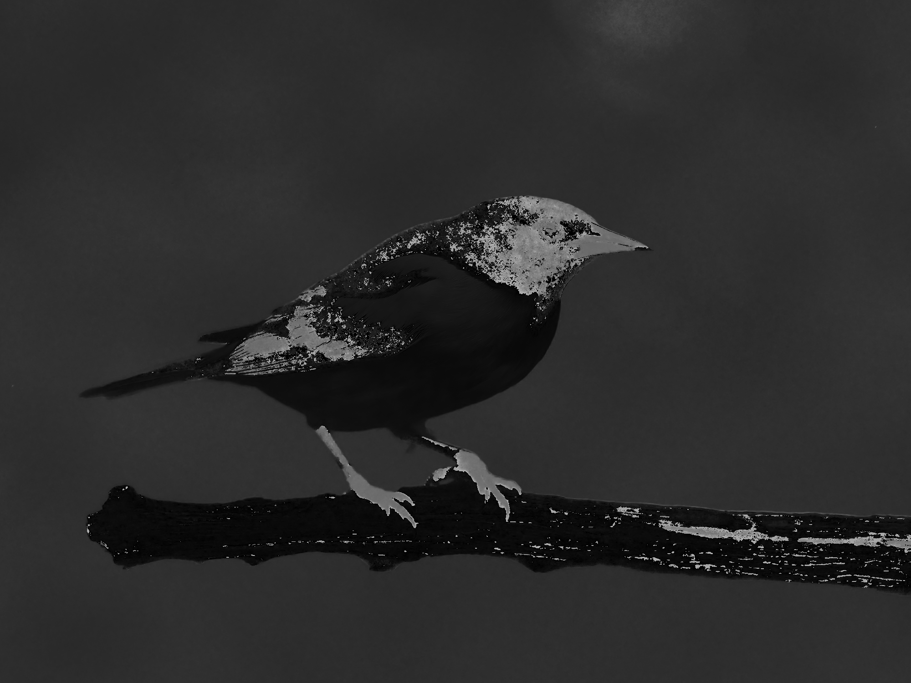
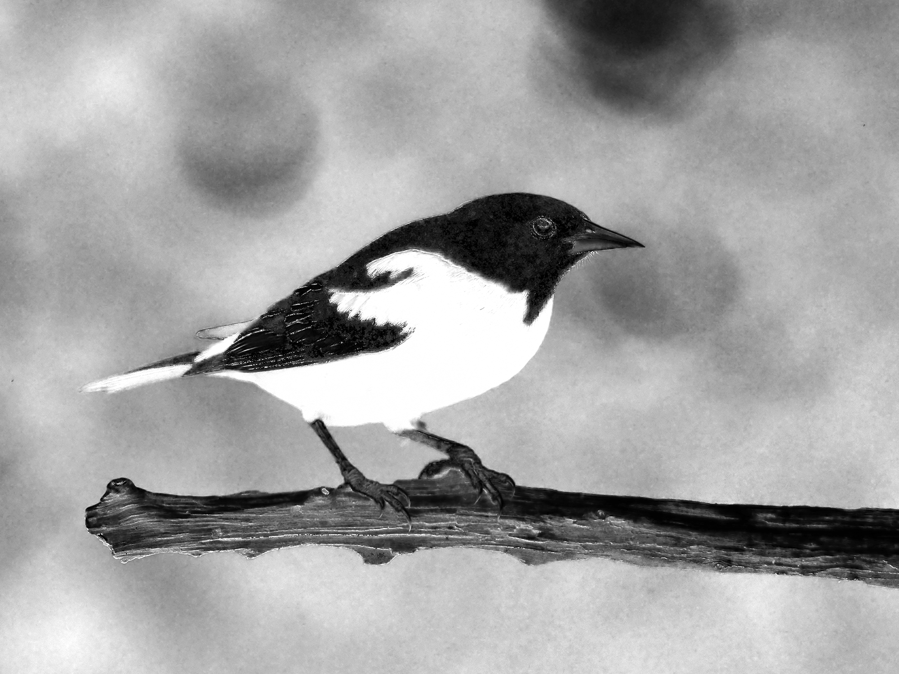
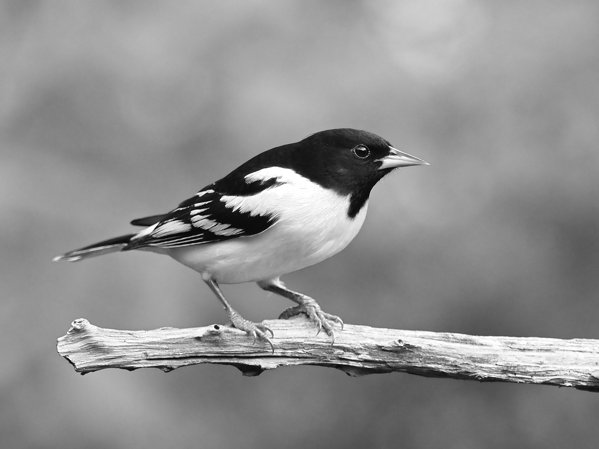
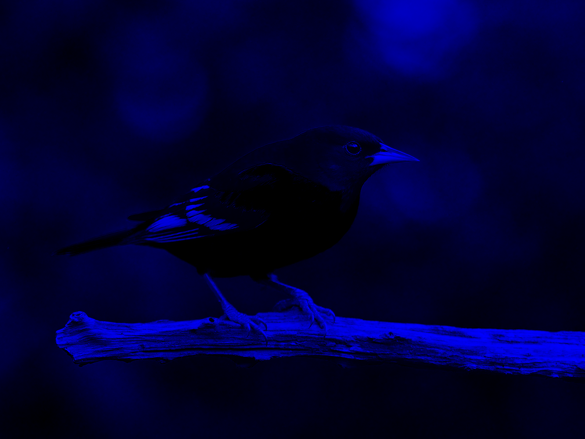
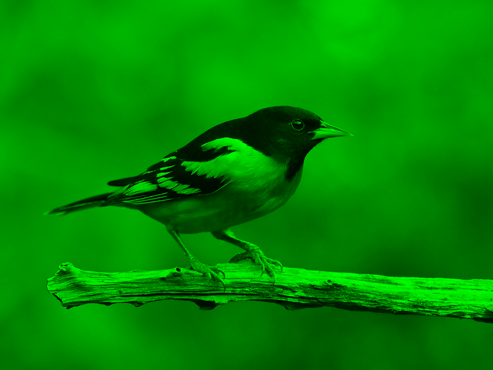
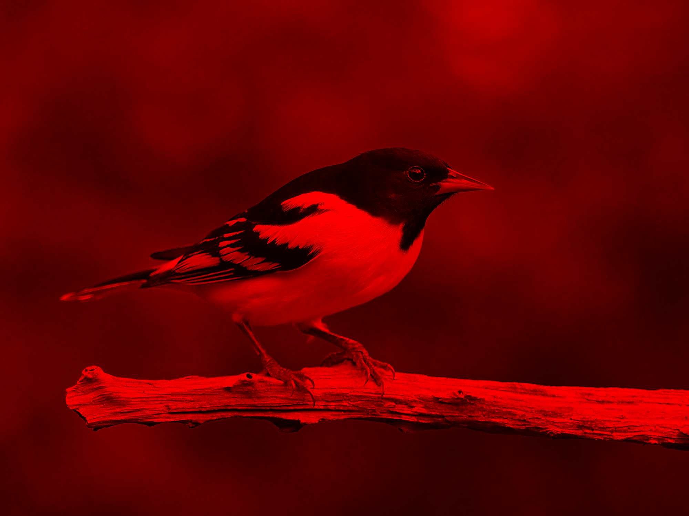
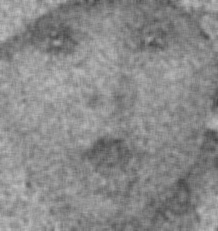
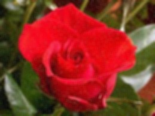

### Bài 1: Nạp ảnh và lưu thành 3 ảnh với 3 màu khác nhau
- Chương trình nạp hình ảnh `bird.png` và tách các kênh màu BGR để lưu thành 3 hình ảnh riêng biệt: đỏ, xanh lá và xanh dương.
Kết quả

### Bài 2: Hoán đổi giá trị các màu
- Chương trình hoán đổi các kênh màu của hình ảnh để chuyển đổi từ BGR sang RGB và lưu lại.
Kết quả

### Bài 3: Chuyển thành hệ màu HSV
- Chương trình chuyển đổi hình ảnh sang không gian màu HSV và lưu các kênh H, S, V thành các tệp riêng biệt.
Kết quả

### Bài 4: Thay đổi giá trị kênh trong không gian màu HSV
- Chương trình thay đổi các giá trị kênh H và V trong không gian màu HSV và lưu ảnh đã được điều chỉnh.
Kết quả

### Bài 5: Áp dụng Mean Filter
- Chương trình áp dụng mean filter cho tất cả hình ảnh trong thư mục `exercise` và lưu kết quả với tiền tố `filtered_`.
  