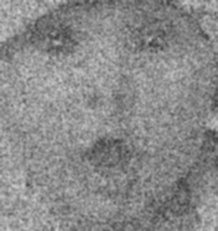
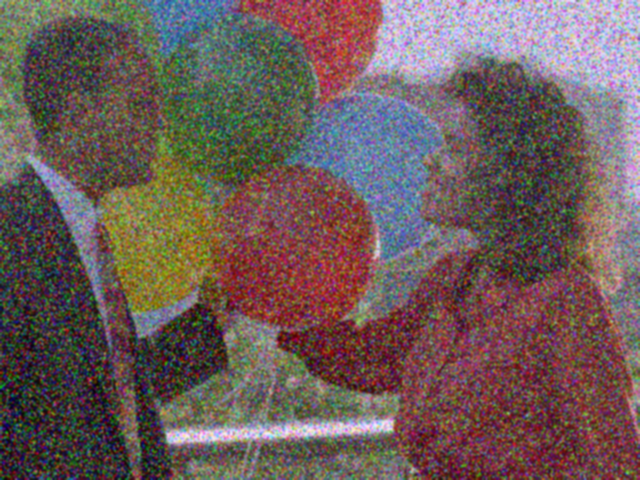
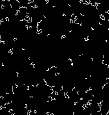
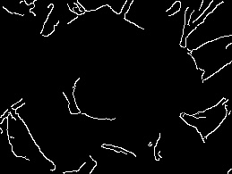
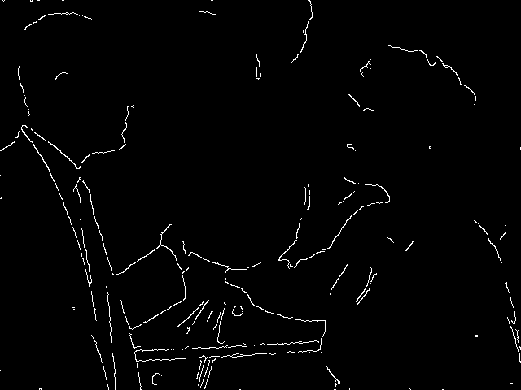
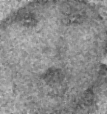
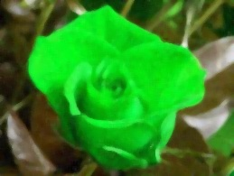
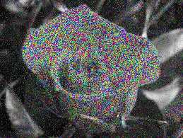
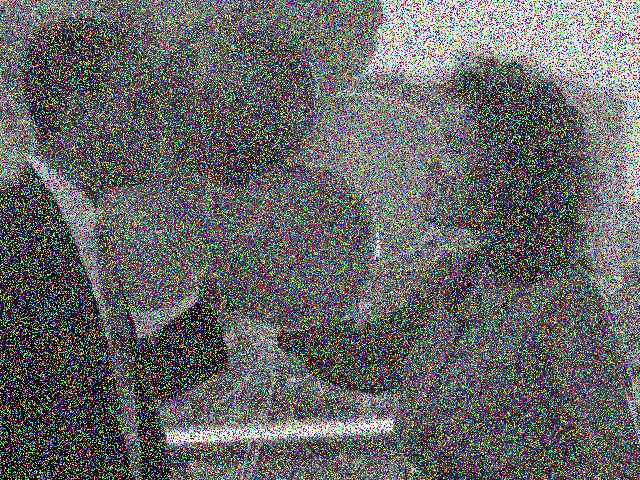

6. Khử Nhiễu
Sử dụng các bộ lọc khác nhau để khử nhiễu hình ảnh.

Kết quả : 
Mean Filter (Bộ Lọc Trung Bình)

 

Gaussian Filter (Bộ Lọc Gaussian)
 

Median Filter (Bộ Lọc Trung Vị)
 

7. Xác Định Biên
Sử dụng bộ lọc Gaussian và hàm Canny để xác định biên của hình ảnh.
 Kết quả : 
  
  
 

8. Đổi Màu RGB Ngẫu Nhiên
Thay đổi màu sắc của từng pixel trong hình ảnh bằng cách nhân với một giá trị ngẫu nhiên.
Ket qua 
 
 

9. Đổi Màu HSV Ngẫu Nhiên
Thay đổi màu sắc trong không gian màu HSV.

Ket qua

  
 
