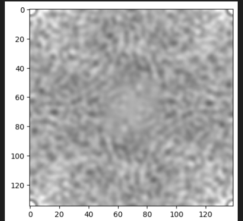

1.1 Biến Đổi Cường Độ Ảnh (Negative Transformation)
Thực hiện phép biến đổi âm bản để đảo ngược giá trị cường độ điểm ảnh, giúp làm nổi bật các vùng tối hoặc sáng trong ảnh.

Kết quả:

1.2 Thay Đổi Chất Lượng Ảnh Với Power Law (Gamma Correction)
Sử dụng phép biến đổi gamma để điều chỉnh độ sáng ảnh. Khi gamma > 1, ảnh sẽ tối hơn; khi gamma < 1, ảnh sẽ sáng hơn.

Kết quả:

1.3 Thay Đổi Cường Độ Điểm Ảnh Với Log Transformation
Biến đổi ảnh sử dụng hàm logarit giúp làm rõ các chi tiết trong vùng tối bằng cách nén các giá trị sáng.

Kết quả:

1.4 Cân Bằng Lược Đồ Histogram (Histogram Equalization)
Tăng độ tương phản ảnh bằng cách phân bố đều cường độ điểm ảnh trong toàn ảnh, sử dụng kỹ thuật cân bằng histogram.

Kết quả:

1.5 Thay Đổi Với Contrast Stretching
Tăng độ tương phản bằng cách dàn trải giá trị cường độ điểm ảnh từ min-max về 0–255.

Kết quả:

1.6.1 Biến Đổi Fourier Nhanh (FFT)
Chuyển ảnh sang miền tần số để quan sát thành phần tần số không gian của ảnh.

Kết quả:

1.6.2 Lọc Ảnh Trong Miền Tần Số
Butterworth Lowpass Filter
Giảm nhiễu và làm mịn ảnh bằng cách loại bỏ tần số cao.

Kết quả:

Butterworth Highpass Filter
Làm nổi bật các cạnh và chi tiết nhỏ bằng cách giữ lại tần số cao.

Kết quả: