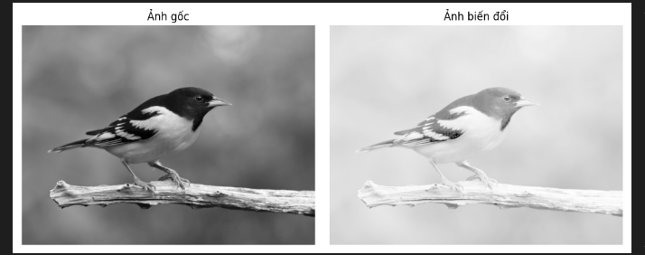
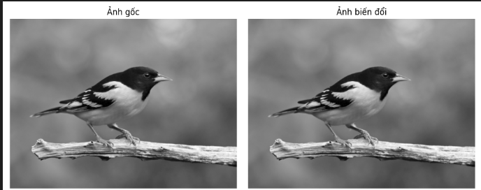

1. Biến Đổi Cường Độ Ảnh
1.1. Biến Đổi Âm Bản (Negative Transformation)
Thực hiện phép biến đổi âm bản để đảo ngược giá trị cường độ điểm ảnh, giúp làm nổi bật các vùng tối hoặc sáng trong ảnh.

1.2. Thay Đổi Chất Lượng Ảnh với Power Law (Gamma Correction)
Sử dụng phép biến đổi gamma để điều chỉnh độ sáng ảnh.
Khi gamma > 1, ảnh tối hơn
Khi gamma < 1, ảnh sáng hơn

1.3. Thay Đổi Cường Độ Điểm Ảnh với Log Transformation
Biến đổi ảnh sử dụng hàm logarit giúp làm rõ các chi tiết trong vùng tối bằng cách nén các giá trị sáng.

1.4. Cân Bằng Lược Đồ Histogram (Histogram Equalization)
Tăng độ tương phản ảnh bằng cách phân bố đều cường độ điểm ảnh trong toàn ảnh.

1.5. Tăng Tương Phản với Contrast Stretching
Tăng độ tương phản bằng cách dàn trải giá trị cường độ điểm ảnh từ min-max về khoảng 0–255.

2. Biến Đổi Ảnh Trong Miền Tần Số
2.1. Biến Đổi Fourier Nhanh (Fast Fourier Transform - FFT)
Chuyển ảnh sang miền tần số để quan sát các thành phần tần số không gian, phục vụ phân tích kết cấu ảnh.

2.2. Lọc Ảnh với Butterworth Lowpass Filter
Giảm nhiễu và làm mịn ảnh bằng cách loại bỏ các thành phần tần số cao.

2.3. Làm Nét Ảnh với Butterworth Highpass Filter
Làm nổi bật các cạnh và chi tiết nhỏ trong ảnh bằng cách giữ lại các thành phần tần số cao.

3. Biến Đổi Kênh Màu RGB Kết Hợp Các Phép Biến Đổi Cường Độ (Từ Câu 1)
Đổi thứ tự các kênh màu RGB một cách ngẫu nhiên, sau đó áp dụng ngẫu nhiên một trong các phép biến đổi: Negative, Gamma, Log, Histogram Equalization, hoặc Contrast Stretching.

4. Biến Đổi Kênh Màu RGB Kết Hợp Các Phép Biến Đổi Tần Số (Từ Câu 2)
Đổi thứ tự các kênh RGB một cách ngẫu nhiên, sau đó áp dụng ngẫu nhiên một trong ba phép biến đổi: FFT, Butterworth Lowpass hoặc Butterworth Highpass Filter.
