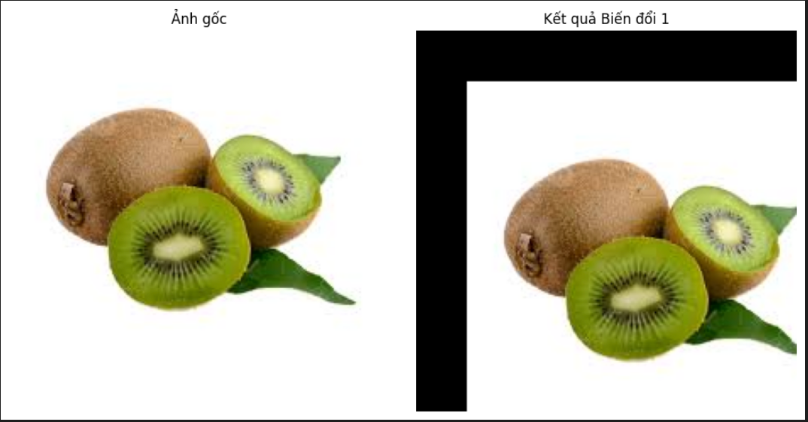

# Bài Thực Hành Xử Lý Ảnh Màu

---

## Bài 1: Tịnh Tiến và Biến Dạng Sóng

Áp dụng phép tịnh tiến ảnh sang phải +50 và xuống +30, sau đó tạo hiệu ứng sóng ngang - dọc bằng ánh xạ toạ độ ngẫu nhiên.

---

## Bài 2: Gradient Màu và Ghép PNG

Tạo ảnh gradient từ trái sang phải với hai màu khác nhau, sau đó ghép hai ảnh lại thành một ảnh PNG có kênh alpha.

---

## Bài 3: Xoay, Phản Chiếu và Ghép Cảnh

Thực hiện:
- Xoay hai ảnh 45 độ
- Phản chiếu dọc
- Ghép hai ảnh lại lên một canvas màu trắng.

---

## Bài 4: Phóng To và Biến Dạng Ảnh (Uốn Sóng)

Ảnh được phóng to 5 lần, sau đó biến dạng theo hàm sin để tạo hiệu ứng uốn cong ảnh như bị sóng làm lệch.

---

## Bài 5: Menu Tương Tác Biến Đổi Ảnh Màu

Cho phép người dùng chọn một ảnh (`kiwi`, `boat`, hoặc `pagoda`) và tương tác qua menu các phép biến đổi sau:

- Tịnh tiến ảnh
- Xoay ảnh
- Zoom (phóng to/thu nhỏ)
- Làm mờ Gaussian
- Biến dạng sóng theo trục ngang

Người dùng nhập trực tiếp các thông số cần thiết (góc xoay, độ dịch chuyển, hệ số zoom, v.v...) từ bàn phím.

---

