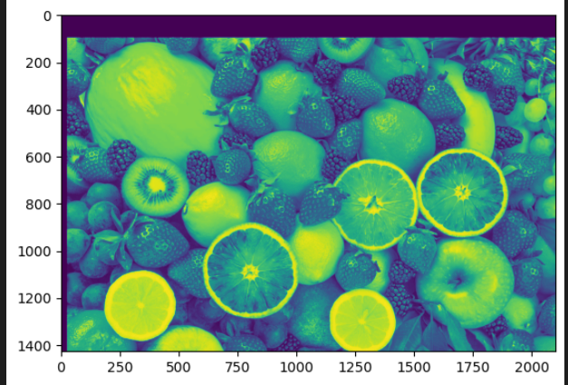
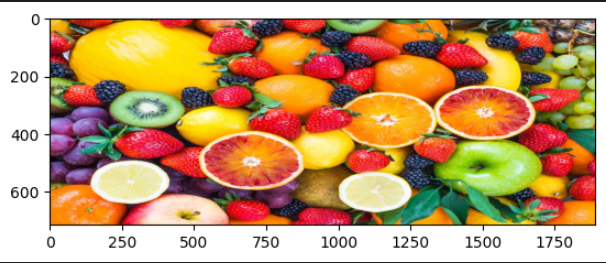
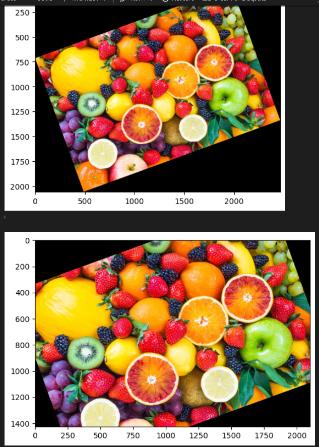
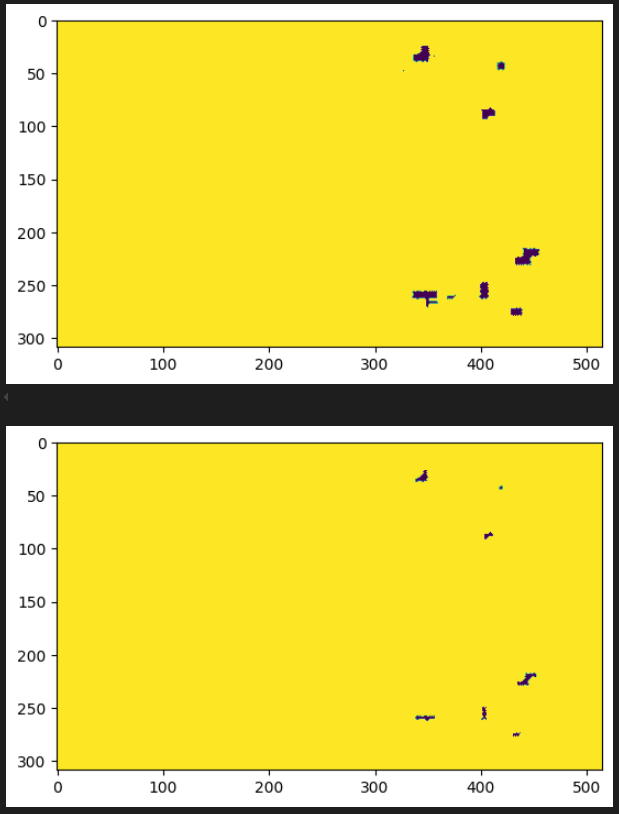

# 1. Biến Đổi Cường Độ Ảnh và Hình Học Trong Xử Lý Ảnh Số

## 1. Chọn Đối Tượng Trong Ảnh

Thực hiện cắt vùng quan tâm từ ảnh gốc, giúp tập trung vào khu vực cần xử lý.

## 2. Tịnh Tiến Đơn

Dịch chuyển ảnh theo hướng xuống 100 pixel và sang phải 25 pixel.

## 3. Thay Đổi Kích Thước Ảnh

Phóng to và thu nhỏ ảnh theo các tỷ lệ khác nhau để kiểm tra khả năng co giãn của ảnh.

## 4. Xoay Ảnh

Xoay ảnh một góc 20 độ với hai chế độ: 
- Có thay đổi kích thước khung chứa (`reshape=True`)
- Giữ nguyên kích thước khung (`reshape=False`)

## 5. Dilation và Erosion

Áp dụng phép **giãn ảnh (dilation)** để làm dày thêm các vùng sáng (trắng) trong ảnh nhị phân.

