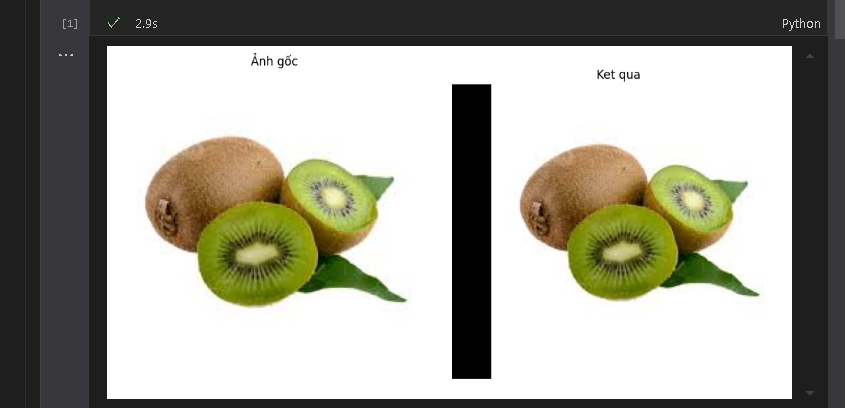
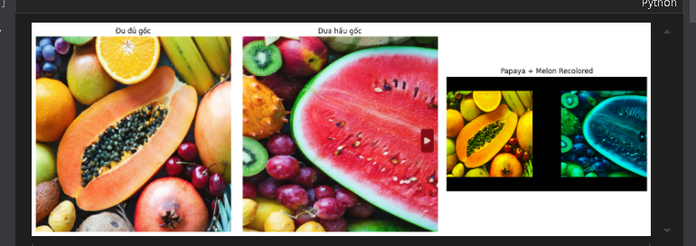
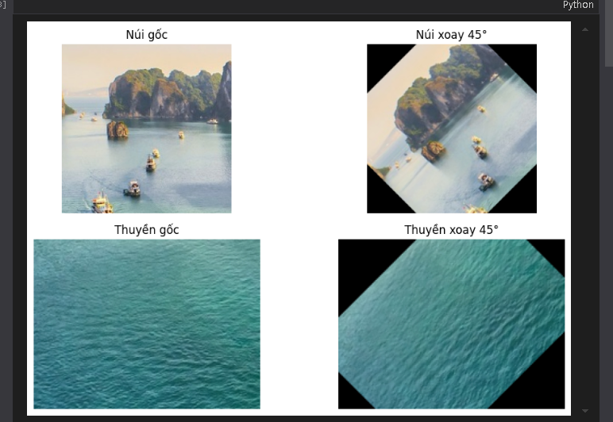
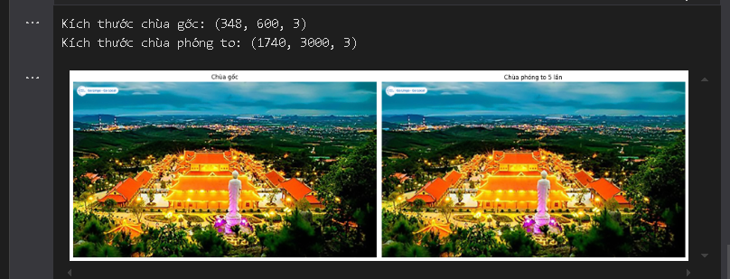
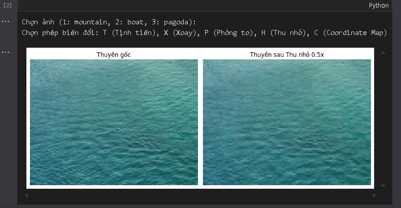

1. **Tịnh tiến ảnh**: Chương trình đọc ảnh `kiwi.jpg`, sử dụng ma trận affine để tịnh tiến ảnh theo trục x, sau đó hiển thị ảnh gốc và ảnh đã dịch chuyển cạnh nhau bằng matplotlib.

2. **Thay đổi màu kênh ảnh**: Dùng 2 ảnh `dudu.png` và `duahau.png`, chương trình thay đổi kênh màu (tắt kênh xanh của đu đủ, tắt kênh đỏ của dưa hấu) để tạo hiệu ứng phối màu, rồi ghép ảnh lên cùng 1 canvas để so sánh và hiển thị.

3. **Xoay đối tượng trong ảnh**: Cắt riêng vùng có ngọn núi và con thuyền từ ảnh `quang_ninh.jpg`, xoay mỗi đối tượng một góc 45 độ, sau đó hiển thị 4 ảnh: núi gốc, núi xoay, thuyền gốc và thuyền xoay.

4. **Phóng to ảnh chùa**: Đọc ảnh `pagoda.jpg` và tăng kích thước ảnh lên 5 lần bằng `cv2.resize` với tỷ lệ `fx=5, fy=5`. Kết quả được hiển thị song song với ảnh gốc giúp người dùng thấy rõ thay đổi.

5. **Tạo menu thao tác ảnh tương tác**: Người dùng được chọn 1 trong 3 hình (núi, thuyền, chùa), sau đó chọn thao tác (Tịnh tiến, Xoay, Phóng to, Thu nhỏ, Map tọa độ). Ảnh trước và sau biến đổi sẽ hiển thị song song để dễ so sánh.

