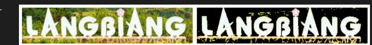
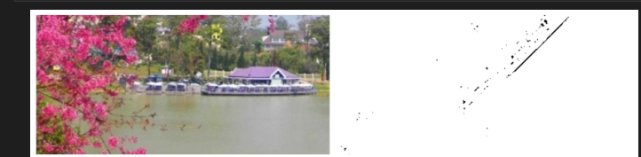
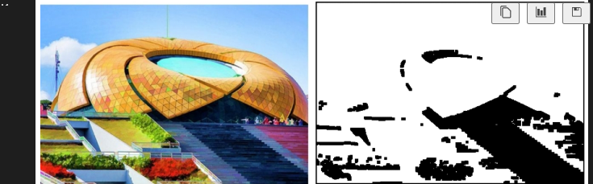
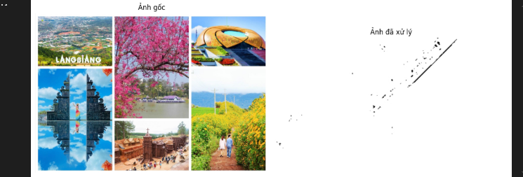
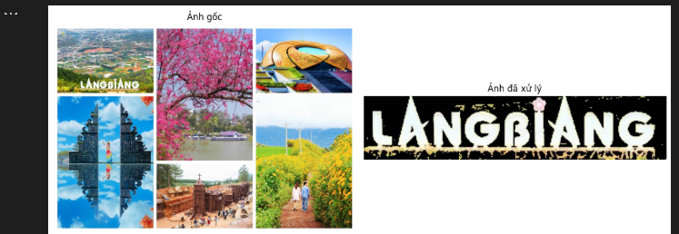
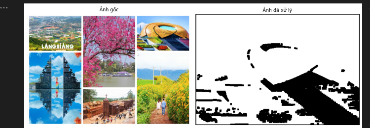

Câu 1: LangBiang – Otsu Thresholding
Yêu cầu: Chọn vùng chữ LangBiang từ ảnh gốc, dùng Otsu thresholding, giữ nguyên màu.
Tọa độ: x=126, y=268, width=312, height=66
Kết quả: 

Câu 2: Hồ Xuân Hương – Adaptive Threshold + Xoay
Yêu cầu: Chọn vùng Hồ Xuân Hương, xoay 45°, dùng Adaptive Thresholding (ngưỡng 60).
Tọa độ: x=510, y=447, width=480, height=228
Kết quả: 

Câu 3: Quảng Trường Lâm Viên – Coordinate Mapping + Closing
Yêu cầu: Chọn vùng quảng trường, thực hiện coordinate mapping + binary closing.
Tọa độ: x=1006, y=19, width=475, height=323
Kết quả: 

Câu 4: Menu chọn và hiển thị ảnh
Yêu cầu: Tạo menu cho phép chọn 1 trong 3 ảnh trên để hiển thị ảnh gốc và ảnh kết quả.
Tùy chọn:
Nhấn 1: Xem LangBiang
Nhấn 2: Xem Hồ Xuân Hương
Nhấn 3: Xem Quảng Trường
Kết quả: Hiển thị song song ảnh gốc và ảnh xử lý bằng Matplotlib

